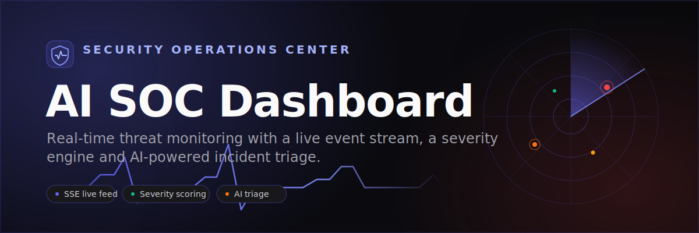
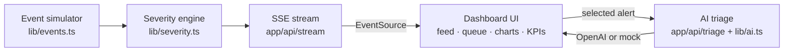

# AI SOC Dashboard — a real-time Security Operations Center with AI triage

[](https://nextjs.org/)
[](https://www.typescriptlang.org/)
[](https://tailwindcss.com/)
[](https://developer.mozilla.org/en-US/docs/Web/API/Server-sent_events)
[](https://recharts.org/)
[](https://platform.openai.com/)
[](./LICENSE)



## Overview

AI SOC Dashboard is a live Security Operations Center in the browser. A
server-side generator continuously streams simulated security events over
Server-Sent Events; a transparent, rule-based engine scores and classifies
each one; and the dashboard renders the result as a SOC analyst would expect
to see it — a real-time event feed, a prioritized alert queue, KPIs and
charts, and on-demand AI incident triage for the alerts that matter.

It runs end-to-end with **zero configuration**. In demo mode the events are
simulated on the server and triage is produced by a built-in mock engine, so
the whole experience works without any API key. Provide an `OPENAI_API_KEY`
and the high- and critical-severity alerts are triaged live by OpenAI.

## ✨ Features

- **Live event stream over SSE** — a Node runtime endpoint emits a fresh,
  severity-classified security event every 1–2 seconds; the client consumes
  it with `EventSource` and renders it in real time.
- **Eight realistic event types** — failed login, brute force, port scan,
  malware, data exfiltration, privilege escalation, DDoS spike and policy
  violation, each with plausible IPs, assets and detection signals.
- **Transparent severity engine** — additive, rule-based scoring (0–100)
  mapped onto critical / high / medium / low, driven by event type plus
  signals like attempt volume, known-bad IPs and off-hours activity.
- **AI incident triage** — one click produces an incident summary and
  prioritized response steps for a selected alert, via OpenAI or a realistic
  per-type mock when no key is set.
- **At-a-glance KPIs** — events per minute, open critical alerts, total
  events and mean severity, recomputed live from the rolling buffer.
- **Visual analytics** — a severity-distribution doughnut and an
  events-by-type bar chart built with Recharts.
- **Auto-scrolling feed with controls** — newest-first, color-coded by
  severity, auto-pauses on hover, plus pause/resume and clear controls.
- **Prioritized alert queue + detail drawer** — critical and high alerts
  first; click one to open a drawer with the full record and AI triage.

## 🧱 Tech Stack

- **Framework** — Next.js 14 (App Router) with React 18 and TypeScript.
- **Styling** — Tailwind CSS with a custom dark SOC theme and severity palette.
- **Streaming** — native Server-Sent Events via a Web `ReadableStream`.
- **Charts** — Recharts.
- **AI** — the official `openai` SDK (optional, demo mode otherwise).
- **Runtime** — Node.js runtime for the streaming and triage API routes.

## 🏗️ Architecture



## 🚀 Getting Started

```bash
git clone https://github.com/maxomart/ai-soc-dashboard.git
cd ai-soc-dashboard
npm install
npm run dev
```

Then open [http://localhost:3000](http://localhost:3000).

Works out of the box in demo mode — events are simulated server-side, no API
key needed. Add `OPENAI_API_KEY` for live AI triage.

```bash
cp .env.example .env.local
# then set OPENAI_API_KEY (and optionally OPENAI_MODEL) in .env.local
```

## ☁️ Deploy

[](https://vercel.com/new/clone?repository-url=https://github.com/maxomart/ai-soc-dashboard)

## 📁 Project Structure

```text
ai-soc-dashboard/
├── app/
│   ├── api/
│   │   ├── stream/route.ts   # SSE endpoint streaming classified events
│   │   └── triage/route.ts   # AI triage endpoint (OpenAI or mock)
│   ├── globals.css           # Dark SOC theme + severity palette
│   ├── layout.tsx            # Root layout and metadata
│   └── page.tsx              # Server component: seeds events, renders dashboard
├── components/
│   ├── Dashboard.tsx         # Top-level client orchestrator + header controls
│   ├── useEventStream.ts     # SSE consumer hook + derived stats
│   ├── KpiRow.tsx            # KPI tiles
│   ├── Charts.tsx            # Recharts severity + type charts
│   ├── LiveFeed.tsx          # Auto-scrolling, hover-pausing event feed
│   ├── AlertQueue.tsx        # Severity-prioritized alert queue
│   ├── AlertDrawer.tsx       # Detail drawer with "Run AI triage"
│   └── SeverityBadge.tsx     # Shared severity pill
├── lib/
│   ├── events.ts             # Server-side event simulator
│   ├── severity.ts           # Rule-based severity scoring engine
│   ├── ai.ts                 # AI triage with demo mode (isDemoMode)
│   ├── types.ts              # Shared domain types
│   └── ui.ts                 # Severity styles + formatting helpers
├── public/banner.svg         # README banner
└── .env.example              # Optional OpenAI configuration
```

## 🗺️ Roadmap

- [ ] Persist events to a database and replay historical incidents.
- [ ] Filtering and full-text search across the live feed.
- [ ] Alert acknowledgement, assignment and status workflow.
- [ ] Webhook / Slack notifications for critical alerts.
- [ ] Pluggable detection rules and MITRE ATT&CK mapping.
- [ ] Authentication and multi-tenant team views.

## 📄 License

MIT © 2026 maxomart

Built by [maxomart](https://github.com/maxomart).
